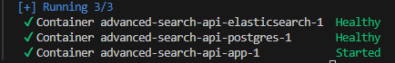

Para ejecutar el proyecto localmente, comienza instalando las dependencias necesarias con el comando `pnpm install` y luego compila el código con el comando `pnpm run build`. Después, construye el contenedor Docker sin usar caché con `docker-compose build --no-cache`, lo que garantiza una reinstalación de dependencias y una reconstrucción desde cero. Una vez que el contenedor se haya construido, levantaremos dos servicios, utilizando `docker compose up -d postgres` y `docker compose up -d elasticsearch`.

Para poblar la base de datos con los datos iniciales (seeds), ejecuta `npx ts-node src/seed.ts`. Puedes verificar que los datos se hayan insertado correctamente utilizando el siguiente comando: `docker-compose exec postgres psql -U user products_db -c "SELECT * FROM product;"`. Esto te permitirá revisar que los productos estén correctamente en la base de datos y que todo funcione según lo esperado. Una vez comprobado los datos, debemos hacer `docker compose up -d app`. 

Para correr nuestra aplicación, en cuanto a las búsquedas, puedes realizar consultas por nombre, categoría o ubicación, y se implementaron variaciones como búsqueda exacta, autocompletado y sugerencias relacionadas para facilitar la experiencia del usuario.

Para ejecutar pruebas unitarias en el proyecto, usa npm run test. Si estás en modo desarrollo y deseas realizar pruebas mientras trabajas, puedes habilitar el modo observador con npm run test:watch. Además, la API cuenta con documentación Swagger completa, que describe los modelos de respuesta de los diferentes endpoints. Puedes acceder a Swagger en la ruta http://localhost:3000/api/ para entender cómo interactuar con la API. 

El proyecto ya cuenta con todas las funcionalidades clave implementadas, como búsqueda por nombre, categoría y ubicación, autocompletado, clasificación por relevancia utilizando _score y boosts, así como sugerencias alternativas o relacionadas. También incluye un controlador bien estructurado, servicios desacoplados, validación de datos y manejo adecuado de errores. Además, se proporciona el archivo advanced-search-api.postman_collection.json para importar los endpoints fácilmente en Postman y comenzar a probar la API de manera eficiente. 🚀📑