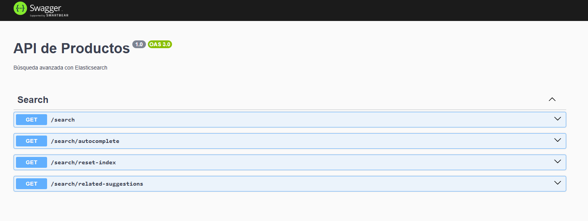

Localmente construimos el build
# pnpm run build 

Comando a ejecutar para construir el contenedor: 

# docker-compose build --no-cache
Fuerza la reinstalación de dependencias y reconstrucción desde cero, ignorando capas cacheadas.

Para completar el proceso después de ejecutar docker-compose build --no-cache debes ejecutar: 
# docker-compose up -d

Es necesario hacer este paso, para cargar los seeds a la base de datos.
# npx ts-node src\seed.ts 

verificamos que tengamos datos en la base de datos: 
# docker-compose exec postgres psql -U user products_db -c "SELECT * FROM product;"

para correr los test 
npm run test

si estas en modo desarrollo
npm run test:watch

🧩 Resumen final
Ya cumpliste con todas las funcionalidades clave:

Requisito	Estado
Búsqueda por nombre, categoría y ubicación	✅
Autocompletado	✅
Clasificación por relevancia (_score + boosts)	✅
Sugerencias alternativas o relacionadas	✅
Controlador limpio con endpoints bien mapeados	✅
Código escalable y limpio (servicio separado)	✅
Swagger completo con modelos de respuesta (opcional)	✅
Validación y manejo de errores	✅

También adjunte el .json para que lograrán importar para postman
advanced-search-api.postman_collection.json

